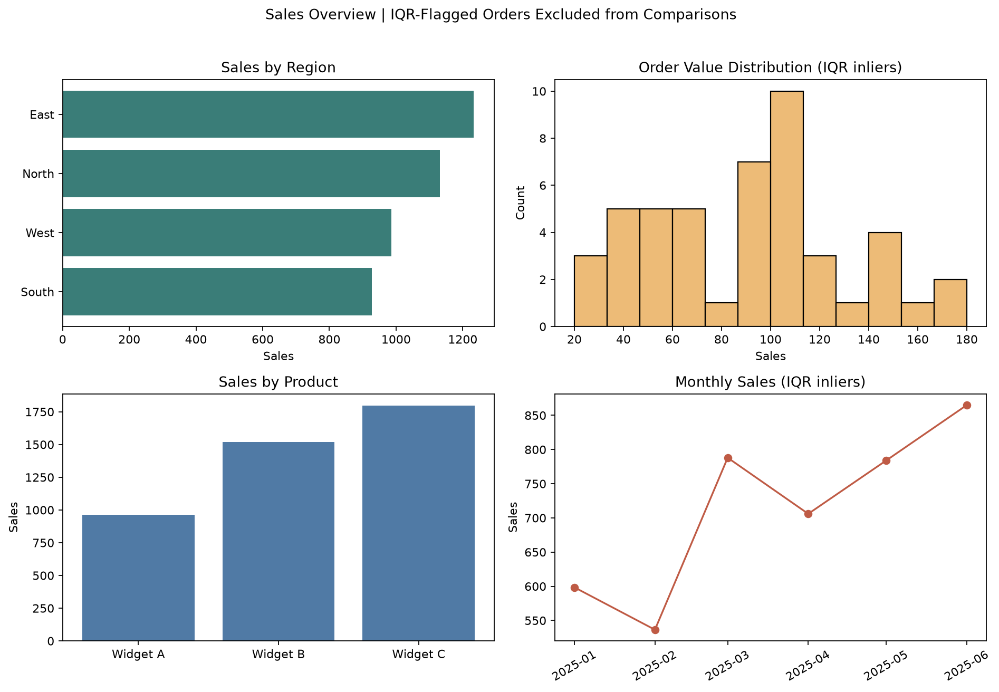

# Retail Sales Performance Explorer

A small, end-to-end sales analysis portfolio project: inspect imperfect order data, document cleaning decisions, compare performance with and without unusual transactions, and explore results in an interactive dashboard.

> **Dataset note:** The included orders are synthetic and deliberately constructed for demonstration. The findings below describe this sample only; they are not claims about a real retailer or market.



## What the Analysis Shows

The source file has **50 rows**. The reproducible pipeline removes one duplicate order ID and imputes two missing quantities, leaving **49 unique orders**. The IQR rule flags two high-sales transactions; they remain available for inspection rather than being silently discarded.

- The flagged orders total **$3,340**, or **43.8%** of cleaned sales. The largest is order `1049` at **$3,120**.
- Excluding flagged orders for like-for-like comparisons, **East** has the highest regional sales at **$1,233** (28.8% of the inlier total).
- **Widget C** leads inlier product sales at **$1,797** (42.0% of the inlier total).

These are descriptive results on a small synthetic sample. The unusually high flagged share is a useful sensitivity example, not a business recommendation.

## Run It

Python 3.10 or later is recommended.

```bash
python -m venv .venv
source .venv/bin/activate       # Windows: .venv\Scripts\activate
python -m pip install -r requirements.txt
python -m streamlit run app.py
```

The dashboard opens in your browser. Use the sidebar to filter dates, regions, and products. IQR-flagged orders are excluded from KPIs and comparative charts by default; switch them on to inspect sensitivity. The **Data quality** tab shows the cleaning audit, and **Order detail** supports CSV download.

To regenerate static figures and the cleaned dataset:

```bash
python -m src.visualization
```

To run the tests:

```bash
python -m pytest -q
```

The notebook at [`notebooks/data_cleaning_analysis.ipynb`](notebooks/data_cleaning_analysis.ipynb) walks through the same workflow interactively.

## Methodology

1. Check required columns; normalize whitespace and region labels.
2. Remove rows without order IDs, keep the first row for duplicate order IDs, and exclude unparseable dates before calculating imputations.
3. Impute missing quantity and unit price with their medians; round imputed quantities to whole units. Fill missing category labels with the mode.
4. Calculate `sales = quantity * unit_price`; flag values outside the 1.5-IQR fences and retain those orders.
5. Compare regional, product, monthly, and order-value measures on the inlier population, while surfacing flagged-order impact separately.

The app and cleaning module expose the same rules and audit counts. Review the assumptions before adapting this workflow to a different business or source system.

## Repository Map

```text
app.py                         Streamlit dashboard
src/data_cleaning.py           Cleaning, validation, and audit helpers
src/analysis.py                KPI, aggregate, and insight functions
src/visualization.py           Static figures and command-line pipeline
data/sales_data.csv            Synthetic, intentionally imperfect input
notebooks/data_cleaning_analysis.ipynb
reports/project_report.md      Methods, findings, and limitations
tests/test_analysis.py         Focused automated checks
images/                        Generated static figures
```

## Data Dictionary

| Field | Meaning |
| --- | --- |
| `order_id` | Unique order key used for duplicate checks |
| `order_date` | Order date, spanning January to June 2025 |
| `region` | Sales region; includes one inconsistent label for cleanup |
| `product` | Product category |
| `quantity` | Units ordered; two values are missing in the raw file |
| `unit_price` | Price per unit in sample dollars |
| `sales` | Derived field: quantity multiplied by unit price |
| `is_sales_outlier` | Boolean IQR review flag; not a deletion instruction |

## Limitations and Next Steps

- Synthetic, intentionally small data cannot establish customer behavior, seasonality, or statistical significance.
- Keeping the first duplicate assumes `order_id` is a stable unique key; conflicting duplicates should be reconciled against source records.
- Median imputation is transparent and reproducible, but changes the observed distribution. Production use should preserve an imputation indicator and confirm the rule with a data owner.
- A statistical outlier may be a valid bulk order. Verify flagged transactions before reporting adjusted totals.

For a real portfolio extension, replace the sample with a properly licensed public dataset, add source provenance, and compare this descriptive analysis with validated business definitions.
